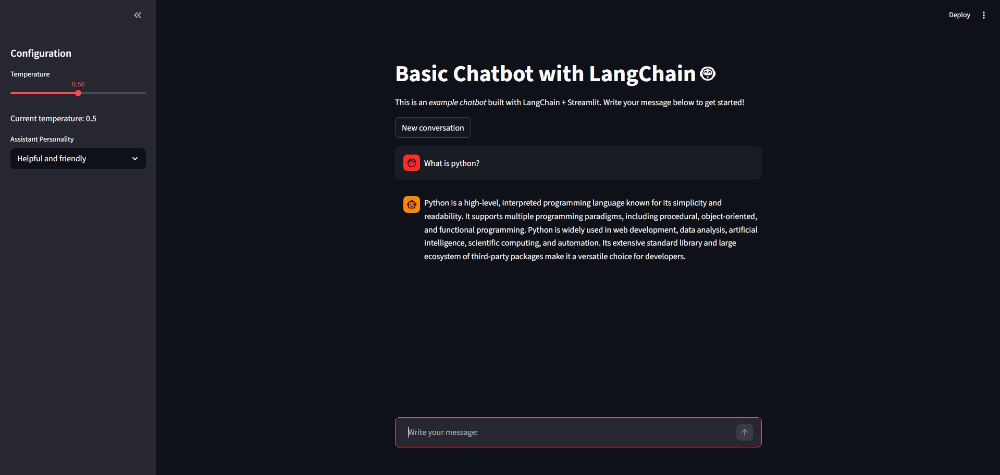

# Langchain Streamlit Chatbot 🤖

Basic chatbot developed in Python with LangChain and Streamlit, which uses a Cohere language model to generate responses.



## 📁 Project Structure

```
langchain-streamlit-chatbot/
├── src/
│   └── streamlit_chatbot.py    # Main chatbot application
├── docs/
│   └── screenshot.png          # Application screenshot
├── .env                        # Environment variables (API keys)
├── requirements.txt            # Python dependencies
└── README.md                   # Project documentation
```

## 🚀 Installation

### 1. Clone the repository
```bash
git clone https://github.com/your-username/langchain-streamlit-chatbot.git
```

### 2. Navigate to the project directory
```bash
cd langchain-streamlit-chatbot
```

### 3. Install dependencies
```bash
pip install -r requirements.txt
```

### 4. Configure environment variables
Create a `.env` file in the root directory and add your API key:

```env
COHERE_API_KEY=your_cohere_api_key_here
```

## 🔄 Alternative LLM Providers

This project uses Cohere by default, but you can also use OpenAI or Google models:

### 🤖 OpenAI
```bash
pip install langchain-openai
```

Environment variable:
```env
OPENAI_API_KEY=your_openai_api_key_here
```

```python
from langchain_openai import ChatOpenAI
chat_model = ChatOpenAI(model="gpt-3.5-turbo", temperature=temperature)
```

### 🧠 Google (Gemini)
```bash
pip install langchain-google-genai
```

Environment variable:
```env
GOOGLE_API_KEY=your_google_api_key_here
```

```python
from langchain_google_genai import ChatGoogleGenerativeAI
chat_model = ChatGoogleGenerativeAI(model="gemini-pro", temperature=temperature)
```

## ▶️ Running the Application

1. Navigate to the src directory:
```bash
cd src
```

2. Run the Streamlit application:
```bash
streamlit run streamlit_chatbot.py
```

The application will open in your default web browser at `http://localhost:8501`.

## 🧪 Project Status

This project is intended as a **basic and educational example** of how to build a chatbot using LangChain and Streamlit.  
It is not intended for production use, but can be easily extended with additional features such as memory, RAG, or multiple LLM support.
